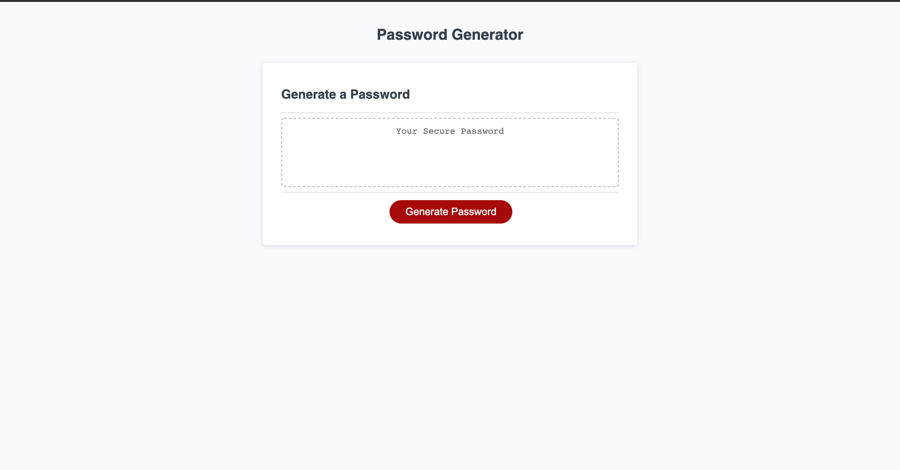

# Password Generator

### This Web Application is a random password generator based on user-specified metrics. 

The Web App queries the user as to whether they want lowercase and uppercase letters, numbers, and special characters. Then, it generates a password of user-specified length using these characters.

You can access the Web App here: [Password Generator Web App](https://saumilkt.github.io/Password-Generator/)
